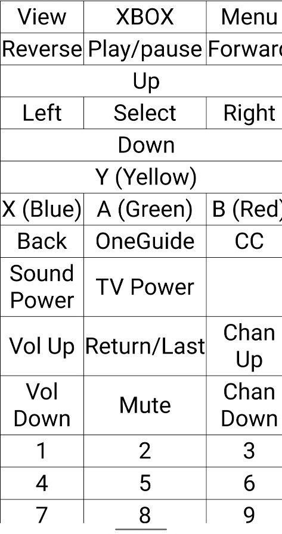

# Web IR Remote Control

Web Remote Control presents a Web UI Media IR Remote control using the
[IRremoteESP8266 library](https://github.com/crankyoldgit/IRremoteESP8266/).
When a web browser opens the home page, Web Remote opens a web socket back to
the ESP web server. The web server sends a JSON string which tells the web
browser how to draw the remote control grid which is just an HTML table with
event listeners on every cell. When the user clicks or touches a grid cell, Web
Remote sends an event encoded as a JSON string back to the ESP web server. The
web server sends an IR code based on which grid cell was clicked/touched.

Any device with a web browser can use Web Remote Control. For example, mobile
phone, tablet, laptop, and desktop all work. More than one web client may be
connected at the same time. This can be confusing but this allows for
co-pilots.

The current implementation is based around an Xbox Media Remote control because
my configuration is an XBox One, Vizio TV, and Logitech Speakers. The remote is
not useful for gaming but it used for running and controlling XBox One
streaming apps such as Netflix.

The grid of buttons and the IR codes are defined in xbox_media.h. Most of the
buttons map to XBox Media remote IR codes. The exceptions are one button sends
the IR code for the Vizio TV Power button. Four buttons (power, volume up,
volume.down, and mute) send Logitech Speaker IR codes. The grid is laid out
similar to an XBox Media remote but it might make sense to remove unused
buttons and/or group the most used buttons together.

## Hardware

https://github.com/crankyoldgit/IRremoteESP8266/wiki

* WeMos D1 mini ESP8266 board
* Transistor
* [940 nm IR LED](https://www.adafruit.com/product/387)

## Software

Install the ESP8266 board package using the IDE Board Manager. See the
following instructions.

https://github.com/esp8266/arduino#installing-with-boards-manager

### Libraries

All are installed using the IDE Library Manager.

* IRremoteESP8266
* ArduinoJson
* WiFiManager
* WebSockets

## Maybe some day

* Add MQTT for lighting control.
* Add cable TV box channel up and down.
* Add IR receiver and learning mode???
